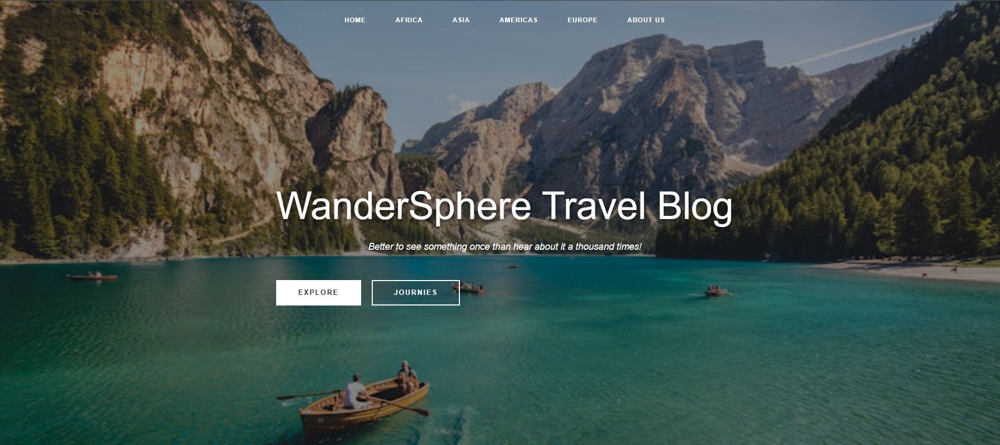
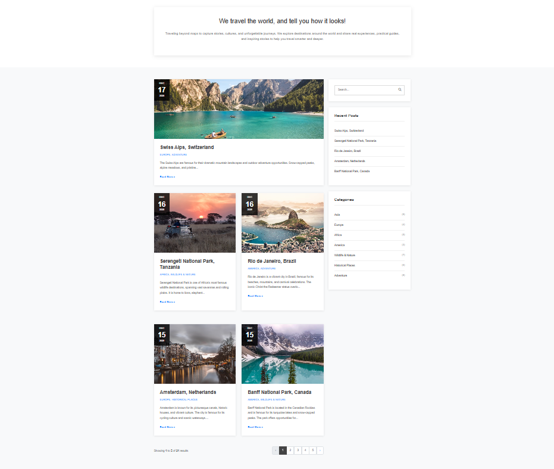
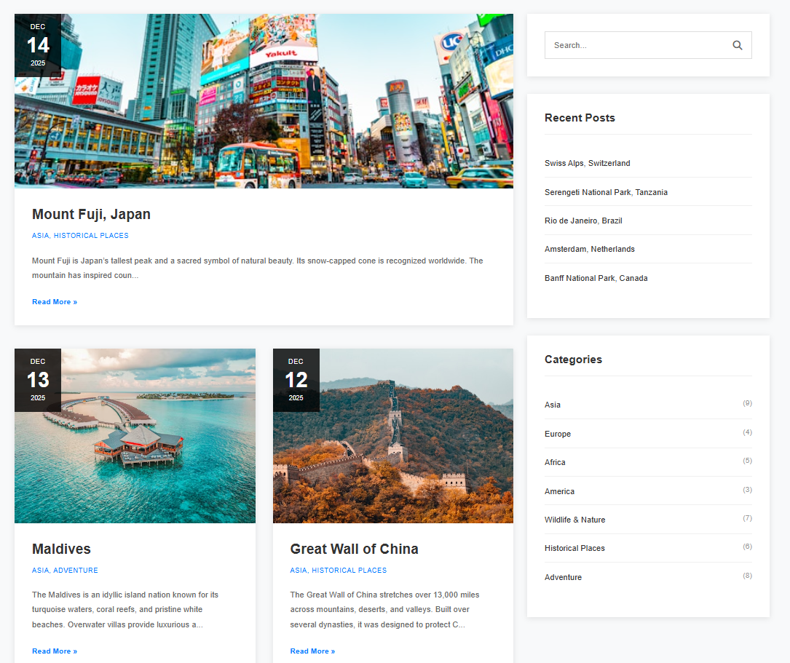
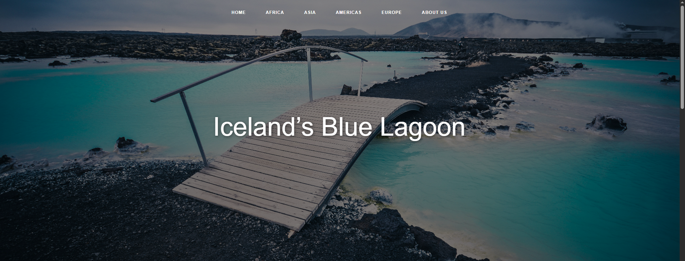
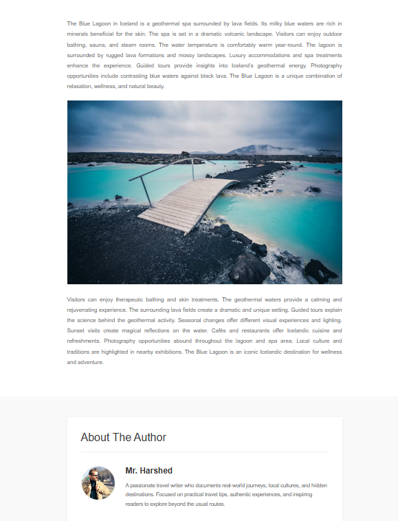
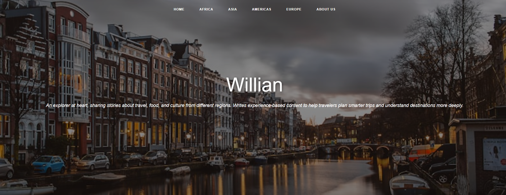
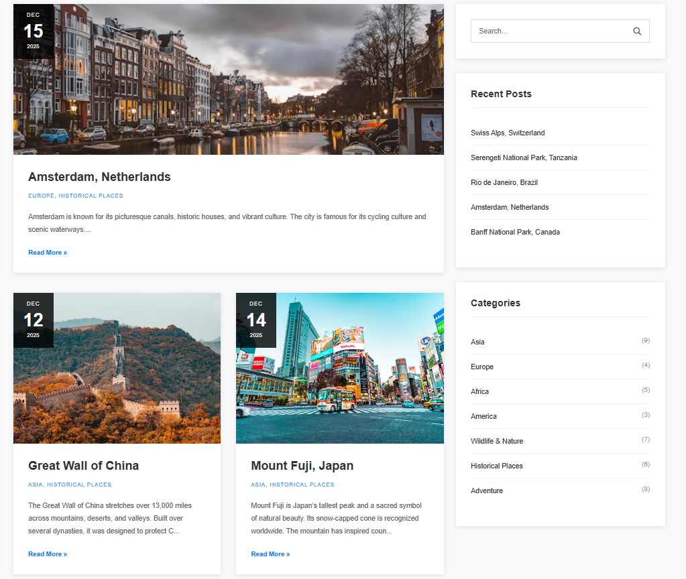

# Travel Blog

## Short Description
Travel Blog is a web-based blogging platform built with Laravel where users can explore travel stories by region, category, and author. The project focuses on implementing real-world blog features such as category-based browsing, author pages, pagination, and clean content organization.

This project was created to practice Laravel fundamentals while building a practical and realistic blog application.


## Live Demo

You can explore the live version of this project here:

🔗 **Live Website:** https://your-live-site-link.com

This live demo allows you to browse posts, filter by categories, view author pages, and experience the full functionality of the Travel Blog.


## 📸 Screenshots

Below are some screenshots of the Travel Blog application to give an overview of the user interface and main features.

### Homepage
Shows the latest 5 travel posts with pagination for browsing older content.




### Category Page
Displays all blog posts under a selected category such as Asia, Africa, America, or Europe.




### Blog Details Page
Shows the full blog content along with author information and related navigation.




### Author Page
Displays all posts written by a specific author along with post count.





## Features
- Homepage shows the 5 most recent blog posts
- All blog posts are displayed with pagination for better performance
- Each blog post can belong to multiple categories (e.g. Asia, Adventure)
- Navigation bar allows users to browse posts by region:
  - Asia
  - Africa
  - America
  - Europe
- Clicking a category displays all posts under that category
- Sidebar includes:
  - Recent posts section for quick access
  - Category list to filter posts
- Each blog has a “Read More” option to view full details
- Blog details page displays complete post content
- Author section is included on the post details page
- Clicking an author name opens a dedicated author page
- Author page shows how many posts the author has written
- Responsive layout built with Bootstrap

## Technologies Used
- Laravel
  - Routing and Resource Routes
  - Controllers
  - Eloquent ORM
- Database Relationships
  - One-to-Many (Author → Posts)
  - Many-to-Many (Posts ↔ Categories)
- Database Seeder for sample data
- Blade Templating Engine
- HTML, CSS, Bootstrap
- MySQL

## Installation & Setup
Follow these steps to run the project locally:

1. Clone the repository
   ```bash
   git clone https://github.com/your-username/travel-blog.git


2. Navigate to the project directory

cd travel-blog

3. Install dependencies

composer install


4. Create the environment file

cp .env.example .env


5. Generate application key

php artisan key:generate

6. Configure database credentials in the .env file

7. Run migrations and seeders

php artisan migrate --seed


8. Start the development server

9. php artisan serve


Open your browser and visit:

http://127.0.0.1:8000


## Usage

Visit the homepage to see the latest travel posts

Use the navigation bar to browse posts by region

Click on a category to view related posts

Use the sidebar to access recent posts or filter by category

Click “Read More” to view full blog details

Click on an author’s name to see all posts written by that author


## 📂 Project Structure

app/ – Models, controllers, and core application logic

routes/ – Web routes for the application

resources/views/ – Blade templates for UI

database/ – Migrations and seeders

public/ – Public assets such as CSS and images

## Future Improvements

Author login system

Admin dashboard for managing posts and categories

Image upload for blog posts

Search functionality

Comment system for readers

Basic SEO optimization


## Author
Mostafizur Rahman — Junior Laravel Developer focused on building real-world web applications using Laravel, PHP, and MySQL. Actively learning backend best practices, Eloquent relationships, and clean MVC architecture through hands-on projects.

